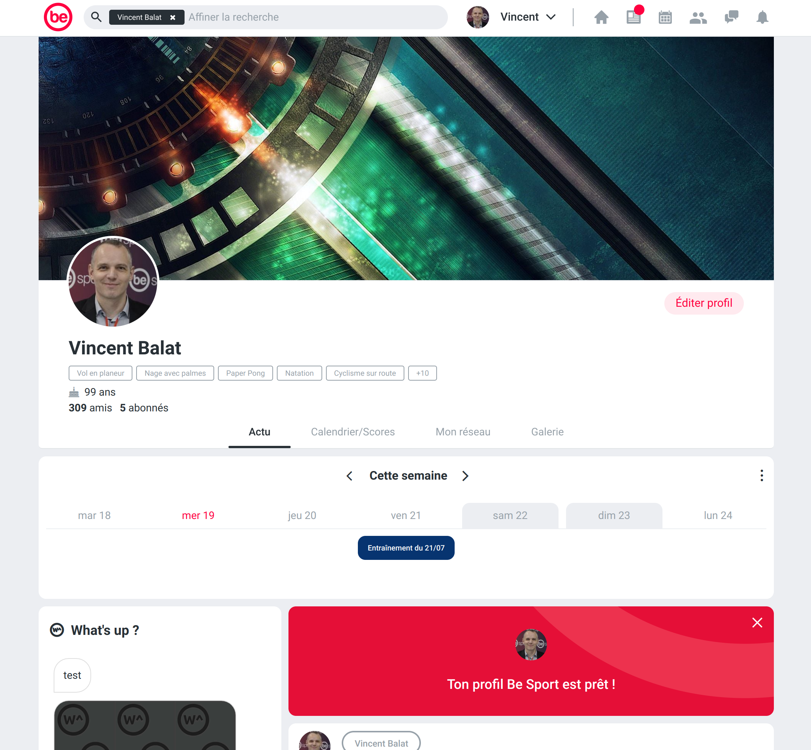
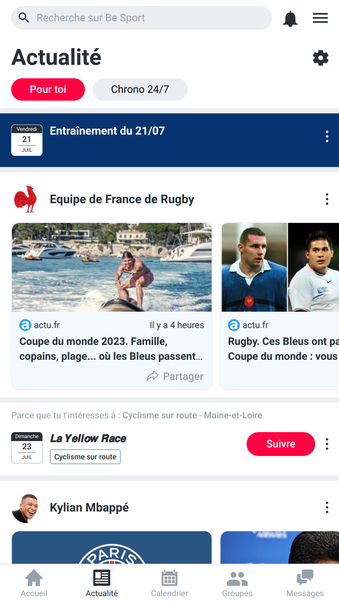
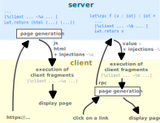
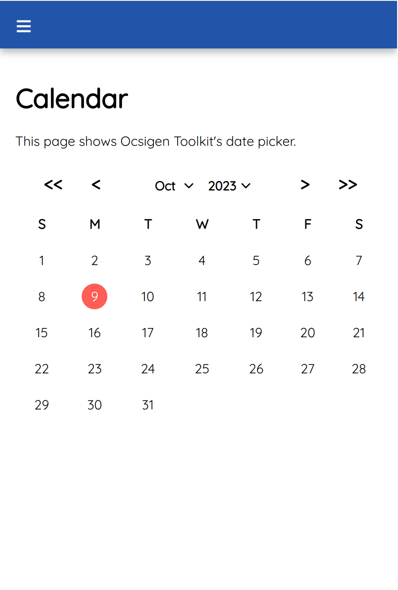
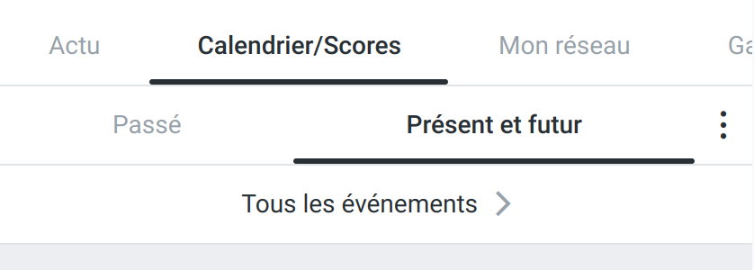
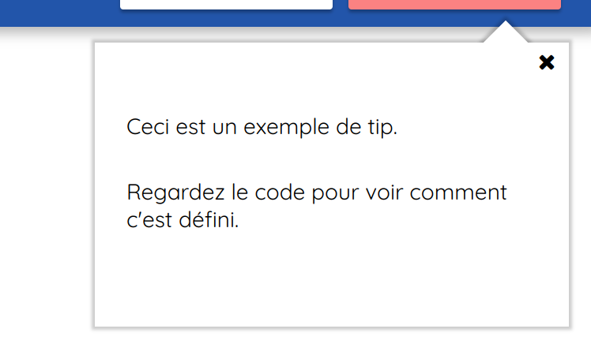
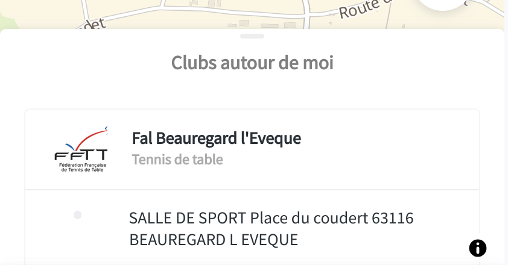

<link rel="preconnect" href="https://fonts.googleapis.com">
<link rel="preconnect" href="https://fonts.gstatic.com" crossorigin>
<link href="https://fonts.googleapis.com/css2?family=Ubuntu:ital,wght@0,300;0,400;0,500;0,700;1,300;1,400;1,500;1,700&display=swap" rel="stylesheet">
<style>
.slip-body {
  font-family: "Ubuntu", sans-serif;
  line-height: 1.4;
  color: #555;
}
a { color: #0c4481; }
code { font-size: smaller; }
.columns {
    display: flex;
    justify-content: space-evenly;
    width: 1300px;
}
.relative {
  position: relative;
}
.col {
    align-self: center;
}
#title { position: relative; margin-left: -110px; }
#title img { width: 1000px; }
#mainh1 {
    flex: 4 1;
    text-align: center;
    width: 400px;
}
.vspace { height: 1em; }
.center { text-align: center; }
.right { text-align: right; }
.smaller { font-size: smaller; }
.focused { outline: 20000px solid #000000aa; }
.comment { color: #888; font-style: italic; }
.encadré {
  position: relative;
  background-color: #ffccaa;
  border-radius: 12px;
  color: black;
  padding: 20px;
}
.encadré p { margin: 0; }
.exo {
  background-color: #f8f8f8;
  border-left: solid 12px #ffccaa;
  border-top-right-radius: 12px;
  border-bottom-right-radius: 12px;
  color: black;
  padding: 10px 40px;
}
.step {
  font-style: italic;
  font-size: smaller;
  background-color: #a0d0fa;
  color: white;
  padding: 4px 25px;
  margin-right: 22px;
  display: inline-block;
  border-radius: 12px;
  }
code { border-radius: 12px; }
.server code { background-color: #ddeeff; }
.client code { background-color: #ffffdd; }
.shared code { background-color: #eeffee; }
.partimg { position: relative; left: -200px; top: -100px; }
.parttitle { position: relative;text-align: right; top: -150px; }
.partsubtitle { position: relative; text-align: right; top: -180px; }
pre.b { margin-bottom: 0; }
pre.b code { border-bottom-left-radius: 0; border-bottom-right-radius: 0; }
pre.bb code { padding-bottom: 0; }
pre.t { margin-top: 0; }
pre.t code { border-top-left-radius: 0; border-top-right-radius: 0; }
pre.tt code { padding-top: 0; }
.hljs-deletion, .hljs-number, .hljs-quote, .hljs-selector-class, .hljs-selector-id, .hljs-template-tag, .hljs-type { color: #2788f1; }
.hljs-string { color: #e88; }
#scopes::before {
  content: '⬉';
  position: absolute;
  top: -90px;
  left: -62px;
  font-weight: bold;
  font-size: 100px;
  color: #ee5522;
}
#servparam .encadré { position: absolute; left: 400px; width: 600px;}
#servparam .encadré::after { content: '⬇'; position: absolute; top: -120px; left: 250px; font-weight: bold; font-size: 100px; color: #ee5522;}
#regparam .encadré { position: absolute; bottom: -100px; left: 200px; width: 600px;}
#regparam .encadré::after { content: '⬇'; position: absolute; top: -120px; left: 40px; font-weight: bold; font-size: 100px; color: #ee5522;}
#regparam2 .encadré { position: absolute; bottom: -100px; left: 200px; width: 600px;}
#regparam2 .encadré::after { content: '⬇'; position: absolute; top: -100px; left: 140px; font-weight: bold; font-size: 100px; color: #ee5522;}
#regparam3 .encadré { position: absolute; bottom: -150px; left: 200px; width: 600px;}
#regparam3 .encadré::after { content: '⬇'; position: absolute; top: -100px; left: 140px; font-weight: bold; font-size: 100px; color: #ee5522;}
#regparam4 .encadré { position: absolute; bottom: -150px; left: 200px; width: 600px;}
#regparam4 .encadré::after { content: '⬇'; position: absolute; top: -115px; left: 110px; font-weight: bold; font-size: 100px; color: #ee5522;}
#regparam5 .encadré { position: absolute; bottom: 120px; left: 550px; width: 600px;}
</style>

{.columns #title}
>{.col style="flex: 0 0;"}
>> 
>{.col #mainh1}
>> # Ocsigen<br/> Quickstart<br/> guide
>>
>>{.vspace}
>> Vincent Balat
>>{.vspace}
>>
>>{.vspace}
>>
>>{.vspace}
>>
>> FUN-OCaml - Berlin<br/> Sep 16-17 2024

{.vspace}

{.vspace}

{.comment .right}
Use arrow keys to navigate

{pause up}

## [Step 1:]{.step} Install

```bash
$ opam install ocsigen-start ocsipersist-sqlite-config
```
{.vspace}

{.vspace}

{.vspace}

{.vspace}

{.comment}
You can find these slides on [ocsigen.org](https://ocsigen.org/talks/tutochat.html) \
and the source code of the slides with the solution of
exercices [on Github](https://github.com/ocsigen/quickstart-guide).

{.comment}
Refer to the main <a href="https://ocsigen.org/tuto/latest/manual/basics" target="_blank">one page user manual</a>
to get more explanations.

{pause up}


[//]: 
[//]: 


{style="position: relative; font-weight: bold; font-size: larger; color: #0c4481;"}
>{.center}
>><br/>
>>
>
>{style="position: absolute; top: 100px; left: 940px;"}
>Ocsigen Server
>
>{#aaa style="position: absolute; top: 320px; left: 1000px;"}
>Eliom
>
>{style="position: absolute; top: 520px; left: 940px;"}
>Js_of_ocaml
>
>{style="position: absolute; top: 700px; left: 800px;"}
>Tyxml
>
>{style="position: absolute; top: 700px; left: 370px;"}
>Lwt
>
>{style="position: absolute; top: 150px; left: 20px;"}
>Ocsigen Start
>
>{style="position: absolute; top: 350px; left: -30px;"}
>Ocsigen Toolkit
>
>{style="position: absolute; top: 540px; left: 50px;"}
>Ocsigen i18n

{pause up-at-unpause=aaa}

{.vspace}

{.center style="font-size: smaller;"}
Jérôme Vouillon, Vincent Balat<br/>
Pierre Chambart, Grégoire Henry, Benedikt Becker,<br/>
Vasilis Papavasileiou, Gabriel Radanne, Hugo Heuzard,<br/>
Benjamin Canou, Boris Yakobowski, Jan Rochel, Idir Lankri,<br/>
Jérémie Dimino, Romain Calascibetta, Raphaël Proust, Anton Bachin, Baptiste Strazzulla,<br/>
Jules Aguillon, Julien Sagot, Stéphane Glondu, Gabriel Kerneis, Denis Berthod, Thorsten Ohl,<br/>
Javaid Habib, Danny Willems, Kate Deplaix, Enguerrand Decorne, Grégoire Lionnet, <br/>
Jaap Boender, Gabriel Scherer, Gabriel Cardoso, Yuta Sato, Sora Morimoto,<br/>
Christophe Lecointe, Arnaud Parant, Jérôme Maloberti, Charly Chevalier, <br/>
[Nicolas Osborne, Jean-Henri Granarolo, Simon Castellan, Barbara Lepage, Séverine Maingaud,<br/>
Mauricio Fernandez, Michael Laporte, Nataliya Guts, Archibald Pontier,<br/>
Jérôme Velleine, Charles Oran, Pierre Clairambault,
Cécile Herbelin]{style="font-size: smaller;"}
…

{pause up}

## Example app: Be Sport

The sports social network
[https://besport.com/news](https://besport.com/news)

{style="position: relative; height: 1000px;"}
>
>

{pause up}

{.partimg}


{.parttitle}
# First part: Server-side programming

{.partsubtitle}
## Write your website in OCaml

{pause up}

## [Step 2:]{.step} Ocsigen Server

### As an executable

```bash
$ ocsigenserver -c config
```
Where `config` is something like:

```bash
<ocsigen>
  <server>
    <port>8080</port>
    <commandpipe>local/var/run/mysite-cmd</commandpipe>
    <logdir>local/var/log/mysite</logdir>
    <datadir>local/var/data/mysite</datadir>
    <charset>utf-8</charset>
    <debugmode/>
    <extension findlib-package="ocsigenserver.ext.staticmod"/>
    <host hostfilter="mydomain.com">
      <static dir="local/var/www/staticdir"/>
    </host>
  </server>
</ocsigen>
```

{pause #lib down-at-unpause=downserver}

{.vspace}

### As an OCaml library

{.server}
```ocaml
let () =
  Ocsigen_server.start
       [ Ocsigen_server.host [Staticmod.run ~dir:"static" ()]]
```
Example of Dune file for this program:

```bash
(executable
 (public_name myproject)
 (name main)
 (libraries
  ocsigenserver
  ocsigenserver.ext.staticmod))
```
Compile with:
```
dune build
```

Find more complex configuration examples in the
[manual](https://ocsigen.org/ocsigenserver/latest/manual/staticlink)

{#downserver}

{pause up}

## [Step 3:]{.step} Generating pages with Eliom

Create a new project:
```bash
$ dune init project --kind=executable mysite
$ cd mysite
```
{.pause}

Define a service in `bin/main.ml`:

{#servunit .server}
```ocaml
let myservice =
  Eliom_service.create
    ~path:(Eliom_service.Path ["foo"])
    ~meth:(Eliom_service.Get Eliom_parameter.unit)
    ()
```
{.relative}
>{.unstatic #servparam .server}
>>```ocaml
>>let myservice =
>>   Eliom_service.create
>>     ~path:(Eliom_service.Path ["foo"])
>>     ~meth:(Eliom_service.Get (Eliom_parameter.(string "myparam" ** int "i")))
>>     ()
>>```
>>{#servparamexpl .encadré}
>>>Use module `Eliom_parameter` to specify which GET or POST parameters you want your page to take.
>>>
>>>Eliom checks types automatically and converts them to OCaml values


Register a handler:

{#regunit .server}
```ocaml
let () =
  Eliom_registration.Html.register ~service:myservice
    (fun () () ->
      Lwt.return
         Eliom_content.Html.F.(html (head (title (txt "The title")) [])
                                    (body [h1 [txt "Hello"]])))
```

{.relative}
>{.unstatic #regparam .server}
>>```ocaml
>>let () =
>>   Eliom_registration.Html.register ~service:myservice
>>     (fun (myparam, _i) () ->
>>       Lwt.return
>>          Eliom_content.Html.F.(html (head (title (txt "The title")) [])
>>                                     (body [h1 [txt myparam]])))
>>```
>>{#regparamexpl .encadré}
>>>The service handler now takes as first argument something of type `string * int`

{.relative}
>{.unstatic #regparam2 .server}
>>```ocaml
>>let () =
>>   Eliom_registration.File.register ~service:myservice
>>     (fun (_myparam, _i) () ->
>>       Lwt.return "filename")
>>```
>>{.encadré}
>>>Services can return other types of content.
>>>
>>>For example, we can return a file

{.relative}
>{.unstatic #regparam3 .server}
>>```ocaml
>>let () =
>>   let a = ref 0 in
>>   Eliom_registration.Action.register ~service:myservice
>>     (fun (myparam, _i) () ->
>>       a := a + 1;
>>       Lwt.return ())
>>```
>>{.encadré}
>>>or an *action*.
>>>
>>>Actions are services performing a side-effect.
>>>Handlers do not return any value.
>>>By default, the current page is regenerated.

{.relative}
>{.unstatic #regparam4 .server}
>>```ocaml
>>let () =
>>   Eliom_registration.Html.register ~service:myservice
>>     (fun (myparam, _i) () ->
>>       Lwt.return ([%html{|<html><head><title></title></head>
>>                            <body><h1>Hello</h1></body>
>>                           </html>|})
>>```
>>{.encadré}
>>>A PPX extension provided by Tyxml makes it possible to use
>>>regular HTML syntax if you prefer

{.relative}
>{.unstatic #regparam5 .server}
>>```ocaml
>>let () =
>>   Eliom_registration.Html.register ~service:myservice
>>     (fun (myparam, _i) () ->
>>       Lwt.return
>>          Eliom_content.Html.F.(html (head (title (txt "The title")) [])
>>                                     (body [p [p [txt myparam]]])))
>>                                               ^^^^^^^^^^^^^^^
>> Error: This expression has type [> p ] elt = 'a elt
>>        but an expression was expected of type [< p_content ] elt = 'b elt
>>
>>       Type 'a = [> `P ] is not compatible with type
>>             'b = [< `A of phrasing_without_interactive
>>                   | `Abbr
>>                   | `Audio of phrasing_without_media
>>                   ...
>>                   | `Output
>>                   | `PCDATA
>>                   | `Progress
>>                   | `Q
>>                   ...
>>                   | `Wbr ]
>>
>>      The second variant type does not allow tag(s) `P
>>```
>>{.encadré}
>>>Tyxml type-checks your HTML!
>>>This makes sure at compile time your program will never generate incorrect pages!

{pause #tyxmlend down-at-unpause=sdkjf}

Start the server with static files and Eliom:

{.server}
```ocaml
let () =
  Ocsigen_server.start
    ~command_pipe:"local/var/run/mysite-cmd"
    ~logdir:"local/var/log/mysite"
    ~datadir:"local/var/data/mysite"
    ~default_charset:(Some "utf-8")
    [
      Ocsigen_server.host
       [ Staticmod.run ~dir:"local/var/www/mysite" ()
       ; Eliom.run () ]
    ]
```
{pause #sdkjf down-at-unpause=servicesdown}

Add packages `ocsipersist-sqlite`, `ocsigenserver.ext.staticmod` and `eliom.server` to file `bin/dune`, in the "libraries" section and create the directories used in the configuration just above.

Compile and run:
```bash
$ dune exec mysite
```

Go to [http://localhost:8080/foo](http://localhost:8080/foo) to test your program.

{pause focus-at-unpause=servunit exec-at-unpause}
```slip-script
slip.setClass(document.querySelector("#servunit"), "focused", true);
```

{pause unfocus-at-unpause="servunit" static-at-unpause="servparam" focus-at-unpause=servparam exec-at-unpause}
```slip-script
slip.setClass(document.querySelector("#servunit"), "focused", false);
slip.setClass(document.querySelector("#servparam"), "focused", true);
slip.setClass(document.querySelector("#servunit"), "unstatic", true);
```

{pause unfocus-at-unpause="servparam" focus-at-unpause=regunit exec-at-unpause}
```slip-script
slip.setClass(document.querySelector("#servparam"), "focused", false);
slip.setClass(document.querySelector("#regunit"), "focused", true);
slip.setClass(document.querySelector("#servparamexpl"), "unstatic", true);
```

{pause unfocus-at-unpause="regunit" static-at-unpause="regparam" focus-at-unpause=regparam exec-at-unpause}
```slip-script
slip.setClass(document.querySelector("#regunit"), "focused", false);
slip.setClass(document.querySelector("#regparam"), "focused", true);
slip.setClass(document.querySelector("#regunit"), "unstatic", true);
```

{pause unfocus-at-unpause="regparam" static-at-unpause="regparam2" focus-at-unpause=regparam2 exec-at-unpause}
```slip-script
slip.setClass(document.querySelector("#regparam"), "focused", false);
slip.setClass(document.querySelector("#regparam2"), "focused", true);
slip.setClass(document.querySelector("#regparam"), "unstatic", true);
```

{pause unfocus-at-unpause="regparam2" static-at-unpause="regparam3" focus-at-unpause=regparam3 exec-at-unpause}
```slip-script
slip.setClass(document.querySelector("#regparam2"), "focused", false);
slip.setClass(document.querySelector("#regparam3"), "focused", true);
slip.setClass(document.querySelector("#regparam2"), "unstatic", true);
```

{pause unfocus-at-unpause="regparam3" static-at-unpause="regparam" focus-at-unpause=regparam exec-at-unpause}
```slip-script
slip.setClass(document.querySelector("#regparam3"), "focused", false);
slip.setClass(document.querySelector("#regparam"), "focused", true);
slip.setClass(document.querySelector("#regparam3"), "unstatic", true);
slip.setClass(document.querySelector("#regparamexpl"), "unstatic", true);
```

{pause unfocus-at-unpause="regparam" static-at-unpause="regparam4" focus-at-unpause=regparam4 exec-at-unpause}
```slip-script
slip.setClass(document.querySelector("#regparam"), "focused", false);
slip.setClass(document.querySelector("#regparam4"), "focused", true);
slip.setClass(document.querySelector("#regparam"), "unstatic", true);
```

{pause unfocus-at-unpause="regparam4" static-at-unpause="regparam" focus-at-unpause=regparam exec-at-unpause}
```slip-script
slip.setClass(document.querySelector("#regparam4"), "focused", false);
slip.setClass(document.querySelector("#regparam"), "focused", true);
slip.setClass(document.querySelector("#regparam4"), "unstatic", true);
```

{pause unfocus-at-unpause="regparam" static-at-unpause="regparam5" focus-at-unpause=regparam5 exec-at-unpause}
```slip-script
slip.setClass(document.querySelector("#regparam"), "focused", false);
slip.setClass(document.querySelector("#regparam5"), "focused", true);
slip.setClass(document.querySelector("#regparam"), "unstatic", true);
```

{pause down-at-unpause="tyxmlend" unfocus-at-unpause="regparam5" exec-at-unpause}
```slip-script
slip.setClass(document.querySelector("#regparam5"), "focused", false);
```

{#servicesdown}

{pause up}

## Sessions: scoped references

Server-side session data is stored in *Eliom references*:

{#eref1 .server}
```ocaml
let r =
  Eliom_reference.eref
     ~scope:Eliom_common.default_session_scope 0


let f () =
  let%lwt v = Eliom_reference.get r in
  Eliom_reference.set r (v + 1);
```

{#eref2 .invisible .server}
```ocaml
let r =
  Eliom_reference.eref
     ~persistent:"myrefname"
     ~scope:Eliom_common.default_session_scope 0

let f () =
  let%lwt v = Eliom_reference.get r in
  Eliom_reference.set r (v + 1);
```

{pause unstatic-at-unpause="eref1" static-at-unpause="eref2"}

{pause}

{.encadré #scopes style="width:550px; left:650px; top:-140px; "}
>Eliom references have a scope!
>
>|**Request**|`request_scope`|
>|**Tab**|`default_process_scope`|
>|**Session**|`default_session_scope`|
>|**Session group**|`default_group_scope`|
>|**Site**|`site_scope`|
>|**Global**|`global_scope`|

{pause up}

## [Step 4:]{.step} Implement a basic login mechanism

{.exo}
>1. On your main page, add a form with a single text input field for a user name.
>
>Submiting this form sends the user name to a POST service, that will register your user name.
>
>When the user name is already known, your main page displays this name, and a logout button.
>
>2. Implement a second page, and add HTML links from one page to the other

{pause}

Hints:
* See an example of form and POST service <a target="_blank" href="https://ocsigen.org/tuto/dev/manual/basics-server#h5o-25">here</a>
* Use an **action** (service with no output, that will just redisplay the page after perfoming a side-effect) to set a scoped reference with the user name
* To close the session use function <a target="_blank" href="https://ocsigen.org/eliom/latest/api/server/Eliom_state#VALdiscard_all">`Eliom_state.discard_all`</a>

Test your app with several browsers to check that you can have several users simultaneously.

{pause down-at-unpause=endstep4}

{.comment}
See the solution <a target="_blank" href="https://github.com/ocsigen/quickstart-guide/blob/Step4/myapp/myapp.eliom">here</a>.

{.exo}
Advanced version: instead of using a reference with scope session,
create a session group whose name is the user name.
Check that you can share session data across multiple browsers.

{#endstep4}

{pause up}


## Service, reinvented

Services have many other features:
* Services can be identified by a **path**<br/>
and/or by a name
added automatically by Eliom as (GET or POST) parameter
* **Secure services** (csrf-safe, secure sessions, https only …)
* **Dynamic creation of services** [Continuation based Web Programming]{.encadré  style="position: relative; left: 40px; top: 20px;"}
  * Scoped services (?scope)
  * Temporary services (?max_use, ?timeout …)

{.vspace}

{pause}

Example:
1. A user submit a form with some data
2. You ask Eliom to create dynamically a new temporary service, identified by an auto-generated name,

The form data will be saved in the closure!

[Functional Web Programming!]{.encadré style="position: relative; left: 700px; top: -100px;"}

{pause up}

{.partimg}


{.parttitle}
# Second part: Client-server programming

{.partsubtitle}
## Write a Web and mobile app in OCaml

{pause up}

## Running code on the client

With Eliom, you can write a client-server Web and mobile app as a single
distributed app!<br/>
To do that, you need a dedicated buid system.<br/>
Use the default basic application template provided by Eliom to get it:

```bash
eliom-distillery --template app.exe -name myapp
```
Have a look at files `myapp.eliom` and `myapp_main.eliom`.

Insert the following line in `myapp.eliom`:

{.client}
```ocaml
let%client () = print_endline "Hello"
```
See the result in your browser's console.

<div style="display: flex; justify-content: space-around;">
<div id="clser">

{style="zoom: 44%; width: 800px;"}
>{.server}
>```ocaml
>let%server () = ...
>```
>{.client}
>```ocaml
>let%client () = ...
>```
>{.shared}
>```ocaml
>let%shared () = ...
>```

</div>
<div id="clserimg">
 
</div>
</div>

{pause focus-at-unpause=clser}

{pause unfocus-at-unpause=clser focus-at-unpause=clserimg}

{pause  unfocus-at-unpause=clserimg down-at-unpause=clientdown1}

### Injections: using server-side values in client side code

{.server .b}
```ocaml
let%server message = "Hello"
```
{.client .t}
```ocaml
let%client () = print_endline ~%message
```

The values are send together with the page (Eliom never calls the server if you don't ask to).

{#clientdown1}

{pause down-at-unpause=clientdown2}

### RPC: calling a server-side function

{.server .b}
```ocaml
let%rpc f (i : int) : unit Lwt.t = Lwt.return (i + 10)
```
{.client .t}
```ocaml
let%client () = ... let%lwt v = f 22 in ...
```
*Warning: type annotations are mandatory*

{#clientdown2}

{pause up-at-unpause=clientdown2}

### Client-values: inserting client-side code in your pages

{.server #onclick}
```ocaml
button ~a:[a_onclick [%client (fun ev -> ... )]] [ ... ]
```

{.shared .b .bb #lwt_js_events}
```ocaml
let%shared mybutton s =
  let b = button [txt "click"] in
  let _ =
```
{.client .t .b .tt .bb}
```ocaml
    [%client (Lwt_js_events.clicks (To_dom.of_element ~%b)
               (fun ev -> Dom_html.window##alert(Js.string ~%s) : unit))
    ]
```
{.shared .t .tt}
```ocaml
  in
  d
```
*Warning: type annotations are mandatory*

{pause down-at-unpause=clientdown3}

The code is actually included in the client-side program as a function,
which is called when the page is received.

On this example, you can see a few new concepts:
* `To_dom.of_element` (or `of_div`, etc.) is used to get the DOM node corresponding to some Tyxml `Eliom_content.Html.D` node
* `Js.string` is used to convert an OCaml string to a Javascript string
* `##` is a syntax used to call Javascript methods in typesafe way. Similarly, `##.` is used to access Javascript object fields.
* `Lwt_js_events` defines a very simple and powerful and simple way to bind interface events (here `clicks` means: *"for all clicks, call the function"*)

{#clientdown3}

<div style="display: flex; justify-content: space-around;">
<div id="clserimg2" style="text-align: center;">
 
</div>
</div>
 
{pause focus-at-unpause=clserimg2}

{pause unfocus-at-unpause=clserimg2 up}

## Client-side services

**Generating pages on the client or the server depending on cases**

This is a typical example of service definition and registration
for a client-server Web and mobile app:

{.server .b}
```ocaml
let%server myservice = Eliom_service.create
                         ~path:(Path ["foo"])
                         ~meth:(Get any)
                         ()
```
{.client .b .t}
```ocaml
let%client myservice = ~%myservice
```
{.shared .t}
```ocaml
let%shared () =
  Eliom_registration.Html.register
    ~service:myservice
    (fun get_params () -> ...)
```

If the service is registered on both sides,
the server side version will be used for the first call (or for indexing by search engines)
the client side version will be used for subsequent calls (or on the mobile app)

{pause up}


## [Step 5:]{.step} Client-server version of your program

{.exo}
>Modify your program to use shared services
>
>Check that when you click on the link, the second page is generated on the client

Hints:
1. For that version, we will keep regular HTML forms with actions implemented
on the server only (which means that the app will restart with a server-side
generated page every time you connect or disconnect).
2. To keep the username on client side, use a regular reference.
   The connection service handler must set both the server-side scoped reference and
   the client-side reference (using a client-value).
   This client-side reference must also be set every time the client process starts,
   that is, when a page is generated on the server (subsequent pages are generated
   on the client, without stopping the client-side process).


{.comment}
See the solution <a target="_blank" href="https://github.com/ocsigen/quickstart-guide/blob/Step5/myapp/myapp.eliom">here</a>.

{pause up}

## [Step 6:]{.step} Send a message to the server

{.exo}
> Add a text input field in the connected version of your page,
> with a submit button, that will send the message to the server.
>
> The server will just display the message in its console

Hints:
* This time, we won't submit the form to a new service, but use a RPC. Use regular Tyxml `input` fields instead of the `Form` module.
* Take example either on the [onclick]{} example above or
  use [Lwt_js_events]{}.

{pause up}

## Sending a message to the client

Eliom has several ways to do server to client communication.

Here we will use module `Eliom_notif`.
It gives you the possibility to define resources on which user can *listen*
or *notify*.

On server side, instanciate functor `Eliom_notif.Make_Simple`.
Type `key` is for resource ids. Type `notification` is for the messages
you want to send.
{.server}
```ocaml
module%server Notif = Eliom_notif.Make_Simple (struct
  type identity = ...
  type key = ...
  type notification = ...
  let get_identity = ...
end)
```
Call `Notif.listen` from server side
if you want to be notified when there is a new message send on a resource.

If you want to send a message to all users listening on a given resource, call function `Notif.notify` from server side.

On client side, `~%(Notif.client_ev ())` is a React event of type
`(key, notif) React.E.t`. Use it to receive the messages.

{pause down-at-unpause=notifdown}

Example:

{.client}
```ocaml
React.E.map (fun notification -> ...) ~%(Notif.client_ev ())
```

{#notifdown}

{pause up}

## [Step 7:]{.step} Send a message to another user

{.exo}
>Make it possible to send a message to another user connected on the same server.
>
>Modify your form to have two fields: one for the recipient name, and one for the message.
>Change your RPC accordingly.
>
>Display the messages you receive in the page.

Make sure that you receive only the message sent to you.

Hints:
1. Instantiate functor `Eliom_notif.Make_Simple` on server side, with `get_identity` being the function to get current user from your scoped reference. Resources are chat channels. Here a channel is identified (`key`) by the recipient name (one channel for each user, where everyone can write).
2. Your RPC to send a message will now notify the recipient (server-side)
3. Every time the client process starts (i.e. every time a page is generated on the server), you need to start listening on your own channel (on server-side), and ask the client to react to event `client_ev`
4. Use module [`Manip`](https://ocsigen.org/eliom/latest/api/client/Eliom_content.Html.Manip) to append the new element to the page


{.comment}
See the solution <a target="_blank" href="https://github.com/ocsigen/quickstart-guide/blob/Step7/myapp/myapp.eliom">here</a>.

{pause up}

{.partimg}


{.parttitle}
# Going further

{pause up}

## Ocsigen Toolkit

*Client-server widgets*

{style="position: relative; height: 900px;"}
>
>
>
>
>


{pause up}

## Ocsigen Start

{style="position: relative;"}
>
>
>
>
>

**Library**<br/>
user management, passwords, etc.

**Application template**

**Code samples**<br/>
Ocsigen Start is the easiest way\
to learn Eliom!

{style="height: 200px;"}

```bash
eliom-distillery --template os.pgocaml -name myapp
```
Then read the README file

{style="height: 400px;"}

{pause up}

{style="position: relative;"}
>

{style="width: 500px; position: absolute; right: 0;"}
>## Mobile apps
>Code run in a webview
>Cordova or Capacitor
>
>Pages generated on client-side
>
>Exact same code
>as the Web app
>
>Use Ocsigen Start to test

{style="height: 1200px;"}

{pause up}

## How to learn more?

Please read the
<a href="https://ocsigen.org/tuto/latest/manual/basics" target="_blank">main documentation page</a> first!

and look at each example in Ocsigen Start's template.

{style="text-align: right;"}
<br/>
[Slides powered by [Slipshow](https://github.com/panglesd/slipshow)]{style="color: #aaa"}.

